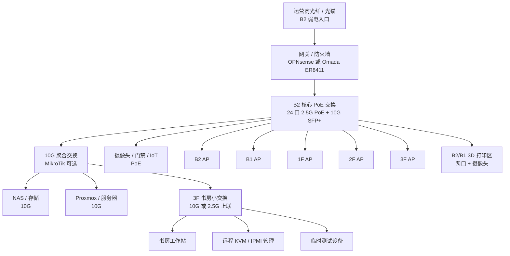

# 香山艺墅 Homelab 布置方案

本文基于设计师提供的 5 张平面图整理，目标是在不牺牲居住体验的前提下，预留稳定、可扩展、便于调试的 homelab、全屋网络和 3D 打印空间。

## 1. 总体结论

- 主 rack 优先放在 B2 设备间。
- 三层书房不作为主机房，只作为工作位、调试位和少量低噪音设备位。
- 3D 打印设备不建议放三层书房，优先放 B2 活动区边缘，或 B1 靠外墙、可通风的位置。
- 全屋网络按 Cat6A 星型回 B2 rack 施工，AP、摄像头、电视墙、书房、打印区都独立回线。
- 设备选型不采用 UniFi。推荐路线是 OPNsense + Omada PoE/AP + MikroTik 10G 聚合，或全套 Omada。

## 2. 空间判断

### B2 设备间

B2 图上有独立设备间，位置靠近楼梯，与主要起居空间有隔离，适合承担噪音、热量、UPS、线缆汇聚和设备维护。

注意事项：

- 设备间内图纸有水点/卫生点位迹象，rack 不应靠近水管、地漏、马桶背墙或洗手盆。
- 如果这个房间确定作为主机房，建议让设计师明确取消或弱化水点功能。
- rack 底部建议做 50-100mm 防水抬高底座。
- 预留漏水传感器、温湿度传感器、烟感和主动排风。

推荐 rack：

- 首选：18U-24U，600mm 宽，800mm 深。
- 如果现场净空充足：600mm 宽，1000mm 深。
- 不建议：42U 或深度超过 1000mm 的大机柜。

检修空间：

- 机柜前方净空不小于 700-800mm。
- 后方如果无法留检修空间，则设备和 PDU 要按前维护思路选择。
- 机柜不要完全封死在木作柜里；如需隐藏，必须有低位进风和高位排风。

### 三层书房

三层书房空间大约是 3.4m x 3.0m 量级，靠近主卧区域。可以放工作桌、显示器、书柜和小型设备柜，但不适合主 rack。

适合放：

- 工作站或笔记本调试位。
- 6U-9U 小型静音柜。
- 2.5G/10G 小交换机。
- 低噪音 Mini PC、NUC、开发板、临时测试设备。
- PiKVM/JetKVM 或远程管理终端。

不建议放：

- 全尺寸机架服务器。
- 大 UPS。
- 多盘位机械硬盘阵列。
- 长时间运行的 3D 打印机。

原因：

- 噪音和硬盘震动会影响三层卧室区域。
- UPS 和服务器风扇热量明显。
- 设备多时线缆汇聚会破坏书房使用体验。

### 3D 打印区

3D 打印不建议与三层书房混用。FDM 打印有噪音、微粒和热风险；树脂打印还有气味、清洗和耗材管理问题。

优先位置：

- B2 活动区靠设备间或外墙一侧。
- B1 靠外墙、可排风位置。

预留要求：

- 2-4 个独立电源插座。
- 1-2 个网口。
- 摄像头视角位。
- 排风管路或带活性炭过滤的封闭柜。
- 耐热台面、耗材干燥箱、工具抽屉。
- 灭火器、烟感、断电继电器或智能插座。

打印机不要接 UPS，UPS 只给网络和核心计算设备供电。

## 3. 推荐网络拓扑



核心思路：

- B2 rack 承担核心网络、存储、服务器、UPS 和汇聚。
- 三层书房承担日常调试和开发。
- 日常 95% 调试通过书房工作站、远程 KVM、IPMI/iDRAC/iLO 完成。
- 只有换硬盘、插线、上架、断电排查时才需要去 B2。

## 4. 设备选型

### 推荐方案 A：OPNsense + Omada + MikroTik

这是最推荐的平衡方案：防火墙可控，AP 和 PoE 管理省心，10G 骨干可玩性强。

| 角色 | 推荐 |
| --- | --- |
| 网关/防火墙 | OPNsense 小主机，N305/i5 级别，至少 4x2.5G；更好是 2x10G + 2x2.5G |
| 核心 PoE 交换 | TP-Link Omada SG3428XPP-M2 |
| 10G 聚合 | MikroTik CRS312-4C+8XG-RM |
| AP | TP-Link Omada EAP772 / EAP773 |
| 控制器 | Omada OC300，或自建 Omada Controller |
| NAS | Synology DS1825+、QNAP、或 TrueNAS 自组 |
| 虚拟化 | 1-3 台 Mini PC / 小型工作站跑 Proxmox |
| 远程管理 | 服务器自带 IPMI/iDRAC/iLO；没有则加 PiKVM/JetKVM |

优点：

- OPNsense 策略、VPN、VLAN、日志更灵活。
- Omada 负责 AP、PoE、漫游和摄像头供电，施工和管理简单。
- MikroTik 专注做 10G 聚合，不需要一开始承担复杂防火墙策略。

缺点：

- 多品牌管理界面较多。
- 初次 VLAN、ACL、路由规划要做清楚。

### 推荐方案 B：全套 Omada

适合优先考虑统一管理、少折腾、后续维护简单。

| 角色 | 推荐 |
| --- | --- |
| 网关 | TP-Link Omada ER8411 |
| 核心交换 | TP-Link Omada SG3428XPP-M2 |
| AP | TP-Link Omada EAP772 / EAP773 |
| 控制器 | Omada OC300 或自建 Omada Controller |
| NAS/服务器 | 与方案 A 相同 |

优点：

- 管理统一。
- AP 漫游、PoE 供电、VLAN 下发相对省心。
- 对施工方和后续维护更友好。

缺点：

- 防火墙和高级网络玩法不如 OPNsense 灵活。
- 以后做复杂策略、透明代理、深度观测时自由度较低。

### 不推荐路线

- 不采用 UniFi。
- 不建议把所有核心设备堆在三层书房。
- 不建议让 MikroTik 作为第一版全功能防火墙，除非明确愿意投入 RouterOS 学习成本。
- 不建议把 3D 打印机接入 UPS。

## 5. Rack U 位规划

以 18U-24U 为目标：

```text
顶部
1U  理线架
1U  光猫 / 运营商设备托盘
1U  网关 / 防火墙
1U  24 口 Cat6A 配线架
1U  核心 PoE 交换机
1U  10G 聚合交换机
1U  理线架
2U  NAS / 或塔式 NAS 托盘
2U  Proxmox 主机 1
2U  Proxmox 主机 2，可选
1U  NVR / 监控主机，可选
1U  Home Assistant / Mini PC 托盘
1U  抽拉屏 / 键盘，可选
2U  UPS
1U  PDU / 空位
底部预留
```

如果 B2 设备间空间紧张，优先保留：

- 光猫/网关。
- 配线架。
- 核心 PoE 交换。
- NAS。
- 1 台虚拟化主机。
- UPS。

第二台服务器、实验设备和临时机器可以放三层书房小柜或 B2 活动区设备柜。

## 6. 线缆与点位预留

### B2 rack 到三层书房

- 至少 4 根 Cat6A。
- 建议额外预留 1 根空管或光纤管。
- 其中 1-2 根用于 10G/2.5G 上联，其他用于桌面、测试和备用。

### AP 点位

- 每层至少 1 个 AP 点位。
- 每个 AP 点位 1 根 Cat6A 回 B2 rack，PoE 供电。
- 别墅楼板和墙体会削弱 5GHz/6GHz，不按标称覆盖面积硬算。

### 固定点位

- 三层书房主工位：4 个网口。
- 客厅电视墙：4 个网口。
- 每个卧室：2 个网口。
- B1/B2 活动区：各 2 个网口。
- 3D 打印区：1-2 个网口。
- 摄像头：每个摄像头 1 根 Cat6A 回 rack，PoE 供电。

### 施工要求

- 所有网线独立回 B2 rack 配线架，不串联、不分叉。
- 线缆两端标签统一：楼层-房间-点位-编号。
- 弱电管线预留 20%-30% 空余。
- 关键干线预留空管，方便以后加光纤或更换线缆。

## 7. 电力与环境

B2 rack：

- 至少 2 组独立插座回路，建议每组 16A。
- PDU 装在机柜内。
- UPS 只接网关、交换机、NAS、关键服务器和管理设备。
- 预留接地、浪涌保护和空开标识。

散热：

- 设备间必须有主动排风。
- 低位进风，高位排风。
- 如果做柜门，柜门需要百叶或通风开孔。
- rack 预估长期热负载按 300-800W 考虑。

监测：

- 温湿度传感器。
- 漏水传感器。
- 烟感。
- rack 内摄像头或 B2 活动区摄像头覆盖机柜门口。

## 8. VLAN 初版规划

| VLAN | 用途 | 说明 |
| --- | --- | --- |
| 10 | Management | 网关、交换机、AP、IPMI、PiKVM |
| 20 | Trusted | 个人电脑、手机、平板 |
| 30 | Server | NAS、Proxmox、服务容器 |
| 40 | IoT | 智能家居、电视、音箱、打印设备 |
| 50 | Camera | 摄像头、NVR |
| 60 | Guest | 访客 Wi-Fi |
| 70 | Lab | 临时测试、实验设备 |

基本策略：

- Management 只允许书房工作站和 VPN 访问。
- IoT 默认不能访问 Trusted，只允许访问必要服务。
- Camera 只能到 NVR/存储，不允许访问普通内网。
- Guest 只出互联网。
- Lab 和生产服务隔离，避免测试设备污染主网络。

## 9. 交给设计师/施工方的表达

可以直接这样沟通：

> B2 设备间需要作为弱电和主机柜位置，请核实能否放 600x800mm 或 600x1000mm、18U-24U 机柜。机柜前方净空不小于 700mm。机柜附近不要保留水点，或至少保证机柜远离水管、地漏和卫生洁具。B2 设备间预留两组 16A 独立回路、Cat6A 弱电汇聚、排风、温湿度/烟感/漏水监测和防水抬高。全屋网线星型回 B2 rack，不允许串联。三层书房预留 4 个网口和一个小设备柜位置。3D 打印区放 B2 或 B1 靠外墙位置，预留电源、网口、摄像头和排风。

## 10. 后续需要现场确认

- B2 设备间净尺寸、门洞宽度、层高和开门方向。
- 设备间是否真的有水点，是否能取消。
- B2 设备间是否能做排风到室外或公共竖井。
- 运营商光纤实际入户位置。
- 各层 AP 安装位置和吊顶条件。
- 三层书房到 B2 的弱电管路是否可走直管或大弯。
- 3D 打印区是否能排风，是否会影响活动区使用。
